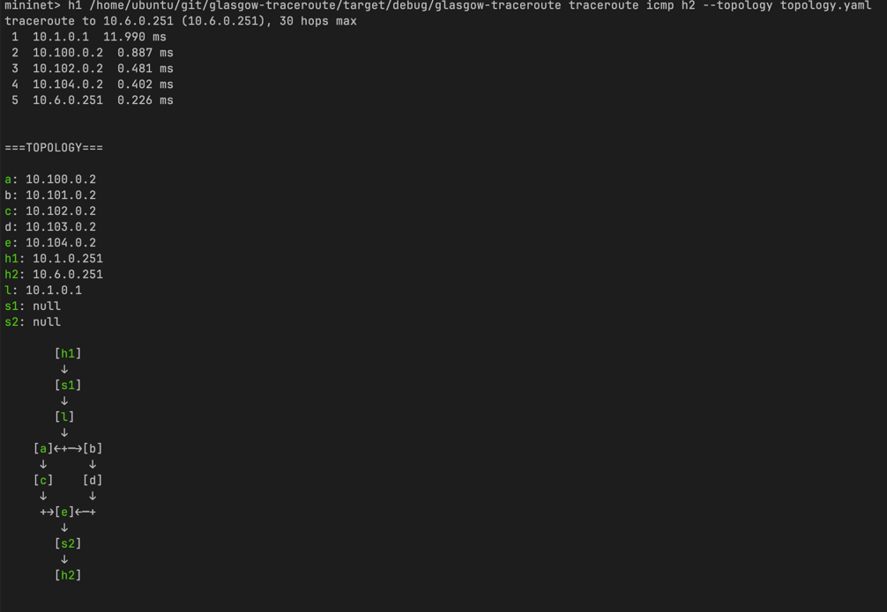

# Printing ASCII Topology of Glasgow-Traceroute Results
## Guide to Setup and Usage
- ASCII Topology Visualisation is a feature of glasgow-traceroute that is executed when using the `--topology` flag. In order to use this feature, a python virtual environment with the required dependencies must be set up.
Example:
```text
mininet> h1 /home/ubuntu/git/glasgow-traceroute/target/debug/glasgow-traceroute traceroute icmp h2 --topology topology.yaml 
traceroute to 10.6.0.251 (10.6.0.251), 30 hops max
 1  10.1.0.1  2.702 ms
 2  10.100.0.2  0.633 ms
 3  10.102.0.2  0.402 ms
 4  10.104.0.2  0.694 ms
 5  10.6.0.251  1.270 ms
Failed to print topology: 
    - Python venv not found or missing dependencies.
    - Please run on the host (not in mininet): src/pycall/setup_py_venv.sh
    - Or run: python3 -m venv .venv && .venv/bin/pip install -r src/pycall/requirements.txt
``` 
- The easiest way to set up the required environment is by running `bash setup_py_venv.sh` script found in `src/pycall/` as stated above.
- Once the virtual environment is set up, you can run glasgow-traceroute with the `--topology` flag from within mininet as shown in the example above again. This time the ASCII topology should print successfully as shown below:
- Example Output:
- Note: If your terminal supports it, the path taken will be highlighted in green.


-  	


